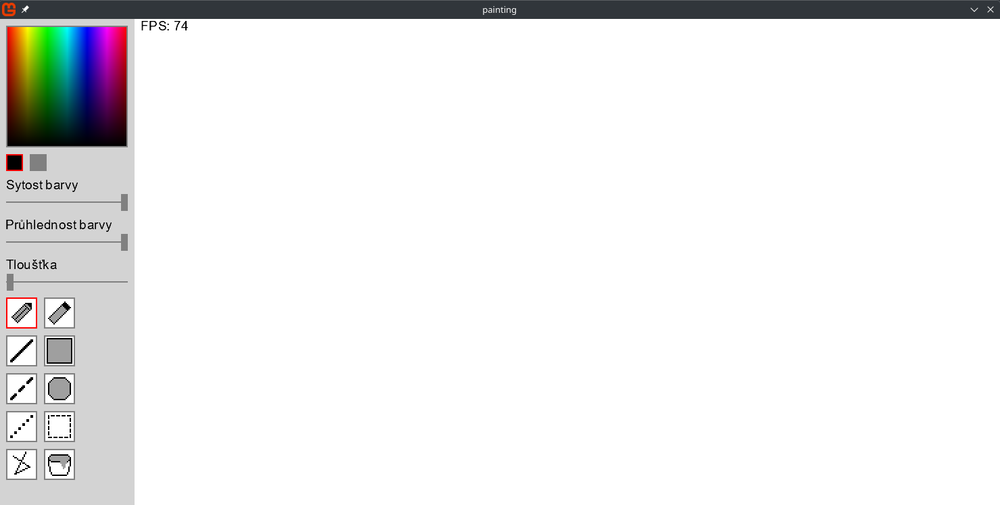

# Dokumentace

## Game.cs

### Přehled

Tento soubor obsahuje hlavní třídu hry `Game1`, která dědí od `Game`. Obsahuje metody pro inicializaci, načítání obsahu, aktualizaci a vykreslování hry.

### Metody

* `Initialize`: Inicializuje velikost okna a platna.
* `LoadContent`: Načítá font a inicializuje `SpriteBatch`.
* `Update`: Aktualizuje stav hry, včetně zmáčknutých kláves a myši.
* `Draw`: Vykresluje hru, včetně hlavního a pomocného platna, vybrané oblasti a notifikace o uložení.

## Components/MenuComponent.cs

### Přehled

Tento soubor obsahuje třídu `MenuComponent`, která představuje UI hry. Obsahuje metody pro vykreslování a aktualizaci menu.

### Metody

* `Draw`: Vykresluje menu, včetně barevného výběru, tloušťky a nástrojů.
* `Update`: Aktualizuje stav menu, včetně zmáčknutých komponent a myši.

## Canvas.cs

### Přehled

Tento soubor obsahuje třídu `Canvas`, která představuje plátno hry. Obsahuje metody pro vykreslování a manipulaci s plátnem.

### Metody

* `SetPixel`: Nastaví barvu pixelu na plátně.
* `GetPixel`: Vrátí barvu pixelu na plátně.
* `CheckIfPixelIsWithinBorders`: Zkontroluje, zda je pixel uvnitř hranic plátna.
* `Clear`: Vyčistí plátno.
* `RemakeTexture`: Přepočítá texturu plátna.
* `DrawCircle`: Vykreslí kruh na plátně.
* `DrawRing`: Vykreslí kruhový prstenec na plátně.
* `DrawLine`: Vykreslí čáru na plátně.
* `Fill`: Vyplní oblast barvou.
* `MergeInto`: Sloučí plátno s jiným plátnem.
* `CutIntoNewCanvas`: Vyřízne část plátna a vrátí ji jako nové plátno.
* `ResizeToNewCanvas`: Změní velikost plátna na novou velikost.

## Rasterizers

### Přehled

Tyto soubory obsahují třídy pro rasterizaci grafických objektů.

### Třídy

* `Rasterizer`: Základní třída pro rasterizaci.
* `CircleRasterizer`: Třída pro rasterizaci kruhů.
* `LineRasterizer`: Třída pro rasterizaci čar.
* `RectangleRasterizer`: Třída pro rasterizaci obdélníků.

### Metody

* `Rasterizer.Rasterize`: Rasterizuje grafický objekt.
* `CircleRasterizer.Rasterize`: Rasterizuje kruh.
* `LineRasterizer.Rasterize`: Rasterizuje čáru.
* `RectangleRasterizer.Rasterize`: Rasterizuje obdélník.

## Objects/Helper.cs

### Přehled

Tento soubor obsahuje třídu `Helper`, která obsahuje pomocné metody pro hru.

# Návod k použití
## Ukázka

* Na levo můžete najít menu, které obsahuje výběr barvy, sytosti a průhlednosti barvy a výběr tloušťky štětce.
* Dále tam můžete najít výběr nástroje
## Nástroje
1. Tužka - Kreslení myší barvou.
2. Guma - Mazaní myší
3. Čára - Kreslení čáry. Při zmáčknutí shiftu se úhel čáry zarovnává na 45˚.
4. Přerušovaná čára - Kreslení přerušované čáry. Při zmáčknutí shiftu se úhel čáry zarovnává na 45˚.
5. Tečkovaná čára - Kreslení tečkované čáry. Při zmáčknutí shiftu se úhel čáry zarovnává na 45˚.
6. Polygon - Kreslení čar navazujících na sebe dokud se nevrátím do začátku. Při zmáčknutí shiftu se úhel čáry zarovnává na 45˚.
7. Obdélník - Kreslení obdelníku. Při zmáčknutí shiftu se zamkne poměr stran na 1:1
8. Kruh - Kreslení kruhu. Při zmáčknutí shiftu se zamkne poměr stran na 1:1
9. Výběr - Umožňuje vybrání části plátna a následné přesunutí a změnu velikosti. Při zmáčknutí delete se výběr smaže.
10. Kbelík - Vyplní část plátna se stejnou barvou, jinou barvou
## Klávesy
* C - Smaže plátno
* ESC - Ukočí kreslení čáry, obdélníku, kruhu, polygonu a ukončí také výběr
* S - Uloží plátno do PNG souboru na plochu